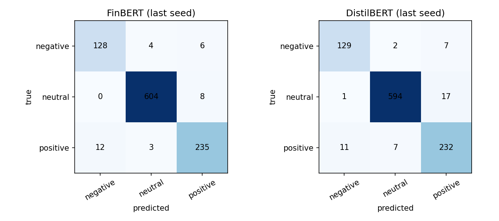

# Financial Sentiment Classifier

Fine-tunes FinBERT to classify sentences from financial news as negative, neutral or positive, and compares it with a DistilBERT baseline trained with the same settings.

## Results

Test set: 1,000 sentences. Each model was trained 3 times (seeds 42, 43, 44). Values are mean ± standard deviation across the 3 runs.

| Model | Accuracy | Macro F1 |
|---|---|---|
| FinBERT (`ProsusAI/finbert`) | 0.967 ± 0.001 | 0.951 ± 0.001 |
| DistilBERT (`distilbert-base-uncased`) | 0.956 ± 0.000 | 0.939 ± 0.001 |

FinBERT is about 1 point ahead on accuracy and 1.2 points on macro F1, in all three seeds. The test set is small, so the gap is modest. A likely reason is that FinBERT was pre-trained on financial text, but I did not test that.

In the last FinBERT run, 33 of 1,000 test sentences were wrong. Most errors are positive sentences predicted as negative (12), negative predicted as positive (6) and neutral predicted as positive (8).

Raw scores for every run are in [`results.json`](results.json).

## Data

- Source: [`FinanceMTEB/financial_phrasebank`](https://huggingface.co/datasets/FinanceMTEB/financial_phrasebank) on Hugging Face.
- 1,264 training and 1,000 test sentences.
- Labels: negative (0), neutral (1), positive (2).
- The classes are imbalanced: 165 negative and 779 neutral sentences in the training set.

## Method

- Tokenizer and model: `ProsusAI/finbert` and `distilbert-base-uncased`, 3-class classification head.
- Class imbalance: weighted cross-entropy loss with balanced class weights (negative 2.55, neutral 0.54, positive 1.32).
- Settings (identical for both models): 4 epochs, learning rate 2e-5, batch size 16, weight decay 0.01, max length 128 tokens, mixed precision on a Colab T4 GPU.
- No hyperparameter tuning. The test set is used once, for the final scores. There is no separate validation set.

## Known limitations

- Small test set, one dataset. Results may not carry over to other financial text.
- Errors can be confident. In the original notebook (`sentiment.ipynb`), "The company filed for bankruptcy today" was predicted neutral with 98.9% confidence, and "Sales remained unchanged from last year" was predicted negative. I have not done a full error analysis.

## Files

| File | Content |
|---|---|
| `finbert_vs_distilbert.ipynb` | Training and evaluation of both models. Source of all numbers above. Run on a GPU (for example Google Colab). |
| `sentiment.ipynb` | First exploration notebook: data checks, tokenisation, class weights, example predictions. |
| `results.json` | Accuracy and macro F1 for every run. |
| `confusion_matrices.png` | Confusion matrices from the last seed. |

## How to run

1. Open `finbert_vs_distilbert.ipynb` in Google Colab.
2. Select a GPU runtime (Runtime > Change runtime type).
3. Run all cells. It takes 10 to 20 minutes.

## Possible next steps

- Error analysis on the misclassified sentences.
- Test on a second financial dataset.
- Add a validation split and tune the learning rate and number of epochs.
